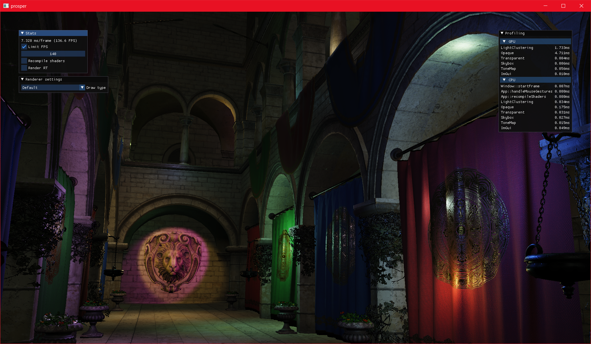

# prosper

[^1]

Vulkan renderer spun off from following https://vulkan-tutorial.com/. Work of [Sascha Willems](https://github.com/SaschaWillems) and [Ray Tracing Gems II](https://developer.nvidia.com/ray-tracing-gems-ii) also used as reference. A limited subset of glTF 2.0 is supported.

### High-level features

- Physically based shading
- Tangent space normal mapping
- Mipmapping
- Transparency (no sorting)
- Skybox
- IBL
  - From the environment map with split sum approximation
- LUT-based display transform
  - [Tony McMapface](https://github.com/h3r2tic/tony-mc-mapface)
- Deferred and forward rendering paths
  - Mesh shaders
  - Drawlist generation and meshlet culling in compute
    - Not all HW supports task shaders so let's have a unified implementation
- ReSTIR DI in deferred path
  - Initial candidate sampling and biased spatial reuse implemented so far
- Path tracing reference
  - Uniformly sampled lights
  - Importance sampled diffuse and specular BRDF
  - Stochastic transparency
- Depth of Field
  - Work in progress based on [A Life of a Bokeh](https://www.advances.realtimerendering.com/s2018/index.htm) among other sources
- Temporal Anti-Aliasing
  - Includes some of the 'usual' tricks for removing ghosting, blurring and flicker
- Animation support for transformations
- Polling shader recompilation
- Render texture debug view
- Streaming mesh and texture loads
  - Separate thread for loading and separate transfer queue for uploads
  - Texture cache with BC7 compression
  - Mesh cache with mesh data optimization and tangent generation
  - Missing or stale cache entries generated during loading
- SPIR-V shader cache

### Under the hood

- Bindless materials
- Bindless geometry
- Ring buffers (SSBO, transfer source)
  - Camera constants
  - Transformations
  - TLAS instances
  - Lights
  - Written each frame to support animation
- Animation updates
  - Raw data copied over from glTF buffers at load time
  - Per parameter animations in flat lists per type
  - Targets register a pointer to the value to be updated
  - Animations are updated in bulk with inline writes to targets
  - Scene transformation update is missing caching for non-dynamic objects' transforms
    - Could also split dynamic and non-dynamic objects in GPU buffers to reduce per-frame upload sizes
- Clustered lighting
  - Points, spots
  - Sphere bounds
  - View space clusters with depth slices
- Pipeline ray tracing
  - TLAS built each frame
- Managed render resources
  - Opaque handles
  - Manual create/release
  - Released resources are reused
  - Handles debug view resource mapping automagically
- Artisanal SPIR-V parsing into shader reflection
  - Rough push constants validation
  - Descriptor set layout generation
  - Descriptor write generation
  - Used for almost all descriptor sets
    - Shared sets are reflected from "header" only
- Scoped profiling
  - GPU with timestamps
  - CPU with `std::chrono`
  - Should be 1:1 mapping between the GPU frame and the CPU frame that recorded it
- Error handling through custom asserts in all build targets
  - This is my own toy and experiment base so no need to complicate things with
    more graceful handling for wrong inputs etc. where it doesn't hurt my workflows
  - Currently still using throws for things that need to report runtime strings
- Custom shader include parser
  - Needed to get cache hashes for the full shader source
  - Basic include expansion with line tags for shaderc
  - Handles comments
  - Bare minimum validation of things that shaderc would not complain about in the expanded source

#### External dependencies

- [Vulkan SDK](https://vulkan.lunarg.com/)
- `xorg-dev` and `libxkbcommon-dev` on Linux

#### Inline dependencies

- [ffx-spd](https://github.com/GPUOpen-Effects/FidelityFX-SPD)
- [Tony McMapface](https://github.com/h3r2tic/tony-mc-mapface)

#### Submodules

- [cgltf](https://github.com/jkuhlmann/cgltf)
- [cxxopts](https://github.com/jarro2783/cxxopts)
- [glfw](https://github.com/glfw/glfw)
- [gli](https://github.com/g-truc/gli)
- [glm](https://github.com/g-truc/glm)
- [imgui](https://github.com/ocornut/imgui)
- [ISPCTextureCompressor](https://github.com/GameTechDev/ISPCTextureCompressor)
- [meshoptimizer](https://github.com/zeux/meshoptimizer)
- [mikktspace](https://github.com/mmikk/MikkTSpace)
- [shaderc](https://github.com/google/shaderc)
- [stb](https://github.com/nothings/stb)
- [VulkanMemoryAllocator](https://github.com/GPUOpen-LibrariesAndSDKs/VulkanMemoryAllocator)
- [wheels](https://github.com/sndels/wheels)

## Building

See the [build workflow](https://github.com/sndels/prosper/blob/master/.github/workflows/build.yml) for the build steps on Windows or Ubuntu 22.04.

## Camera controls

Only when free look is toggled if camera is animated

- RMB/MMB drag - Trackball drag
- Scroll up/down - Dolly forward/back
- RMB/MMB drag + Alt - Plane drag
- WASDQE - Movement
  - Shift - Double speed
  - Ctrl - Half speed

## wheels

Much of the typical STL use is replaced by my own implementations, [wheels](https://github.com/sndels/wheels). I don't think STL was ever in any way a hindrance in this project, but I found it an interesting endeavor to try and come up with my own version of it. I also ended up having explicit allocators for the dynamic containers and this is already a non-trivial project where I can try how the choice affects the user code. Turns out having to juggle allocators and trying to use linear ones makes you much more concious of (re)allocations.

I also tried the "zig style" of passing allocators into functions and ctors explicitly, but that ended up mostly just obfuscating which allocator was used where. Using the allocators from a global makes it much easier to grep where they are used and spot e.g. when world things seem to lean on the general allocator excessively. Thus, only parts that are called with different allocators in different places, use ScopedScratch or use the ScopedScratch of the caller (as an abstract Allocator) take in allocator as a paramater.

[^1]: Scene modified from Crytek Sponza, originally by Frank Meinl with tweaks by Morgan McGuire, Alexandre Pestana and the authors of [glTF-Sample-Models](https://github.com/KhronosGroup/glTF-Sample-Models/tree/master/2.0/Sponza)
