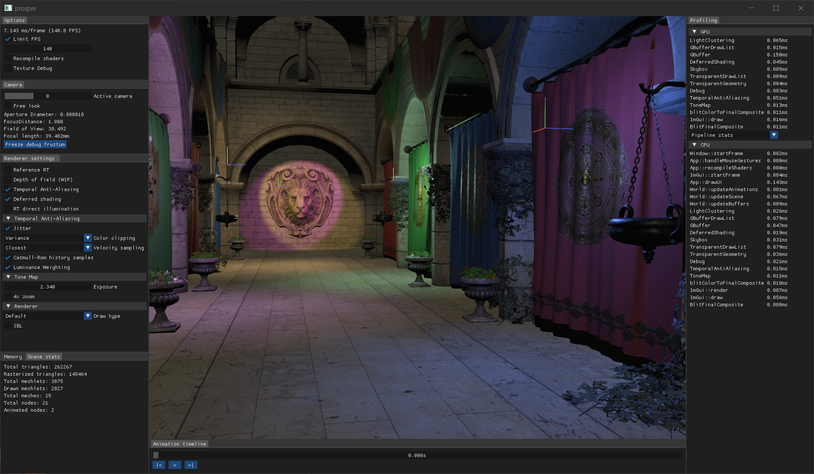

# prosper

[^1]

Vulkan renderer spun off from following https://vulkan-tutorial.com/. Work of [Sascha Willems](https://github.com/SaschaWillems) and [Ray Tracing Gems II](https://developer.nvidia.com/ray-tracing-gems-ii) also used as reference.

Current features include:

- glTF 2.0 assets
  - Only a very limited subset is currently supported
- Physically based shading
- Tangent space normal mapping
- Mipmapping
- Transparency (no sorting)
- Skybox
- 1D ACES-tonemap[^2]
- Clustered lighting
  - Points, spots
  - Sphere bounds
  - View space clusters with depth slices
- Bindless materials
  - Streaming texture loads
    - Separate thread for loading when a distinct queue is available for transfers
  - Texture cache with BC7 compression
    - Generated during texture load when a scene is loaded the first time
- Bindless geometry
- Managed render resources
  - Opaque handles
  - Manual create/release
  - Released resources are reused
- Deferred and forward rendering paths
- Pipeline ray tracing
  - Naive path tracing
- Polling shader recompilation
- Artisanal SPIR-V parsing into shader reflection
  - Rough push constants validation
  - Descriptor set layout generation
  - Descriptor write generation
  - Used for almost all descriptor sets
    - Shared sets are reflected from "header" only
- Scoped profiling
  - GPU with timestamps
  - CPU with `std::chrono`
  - Should be 1:1 mapping between the GPU frame and the CPU frame that recorded it

Depends externally on [Vulkan SDK](https://vulkan.lunarg.com/) and, on Linux, `xorg-dev`. Includes [cxxopts](https://github.com/jarro2783/cxxopts), [glfw](https://github.com/glfw/glfw), [gli](https://github.com/g-truc/gli), [glm](https://github.com/g-truc/glm), [imgui](https://github.com/ocornut/imgui), [ISPCTextureCompressor](https://github.com/GameTechDev/ISPCTextureCompressor), [libshaderc](https://github.com/google/shaderc), [tinygltf](https://github.com/syoyo/tinygltf) and [VulkanMemoryAllocator](https://github.com/GPUOpen-LibrariesAndSDKs/VulkanMemoryAllocator) as submodules.

## Building

See the [build workflow](https://github.com/sndels/prosper/blob/master/.github/workflows/build.yml) for the build steps on Windows or Ubuntu 22.04.

## Camera controls

- RMB/MMB drag - Trackball drag
- Scroll up/down - Dolly forward/back
- RMB/MMB drag + Alt - Plane drag
- WASDQE - Movement
  - Shift - Double speed
  - Ctrl - Half speed

## wheels

Much of the typical STL use is replaced by my own implementations, [wheels](https://github.com/sndels/wheels). I don't think STL was ever in any way a hindrance in this project, but I found it an interesting endeavor to try and come up with my own version of it. I also ended up having explicit allocators for the dynamic containers and this is already a non-trivial project where I can try how the choice affects the user code. Turns out having to juggle allocators and trying to use linear ones makes you much more concious of (re)allocations.

[^1]: Scene modified from Crytek Sponza, originally by Frank Meinl with tweaks by Morgan McGuire, Alexandre Pestana and the authors of [glTF-Sample-Models](https://github.com/KhronosGroup/glTF-Sample-Models/tree/master/2.0/Sponza)
[^2]: From a blog post by [Krzysztof Narkowicz](https://knarkowicz.wordpress.com/2016/01/06/aces-filmic-tone-mapping-curve)
